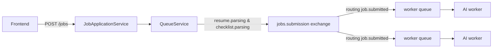
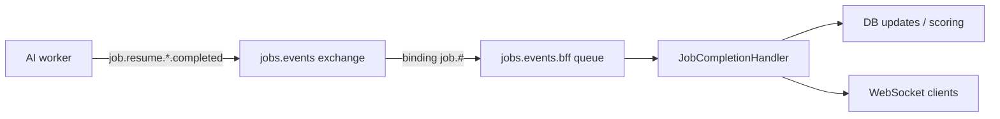
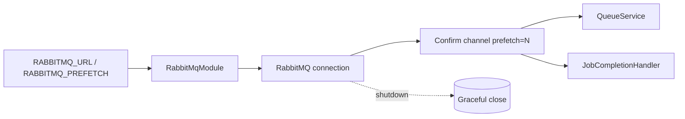
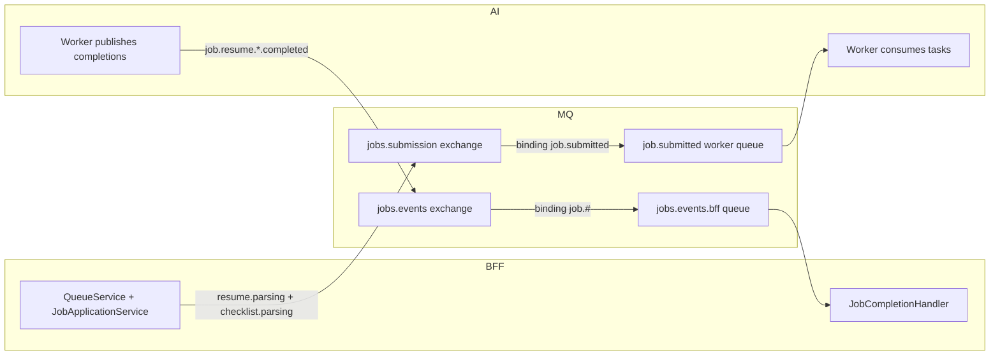

# RabbitMQ Architecture Figures

## Publisher/Submission Path (BFF ➜ RabbitMQ ➜ AI Workers)

## Completion/Events Path (AI Workers ➜ RabbitMQ ➜ BFF ➜ WebSocket)

## Connection & Channel Setup

## End-to-End Topology (BFF → RabbitMQ ← AI)

