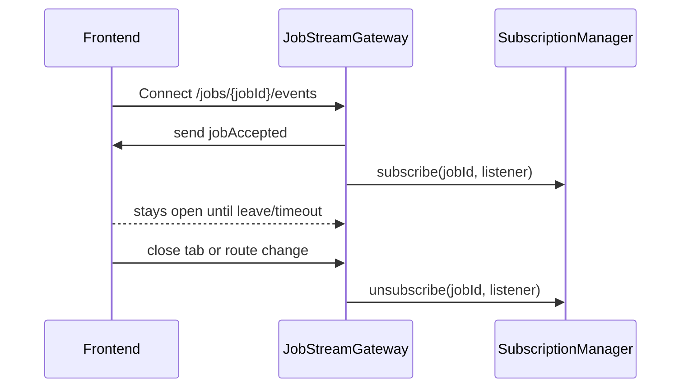
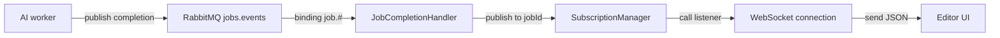

# WebSocket Flow in Applywise

How real-time job updates travel from the backend to the UI.

## Key pieces
- **Endpoint:** `GET /jobs/:jobId/events` (Fastify WebSocket route in `JobStreamGateway`).
- **Subscription manager:** `JobEventsSubscriptionManager` keeps a `Map<jobId, listeners>` and forwards events to the right sockets.
- **Consumer:** `JobCompletionHandler` consumes RabbitMQ job events and publishes them into the manager.
- **Frontend hook:** `useEditorWebSocket` opens the WS when the editor loads with `jobId` and updates React Query + stores on incoming messages.

## Connection lifecycle

## Event delivery path

## Frontend usage
- Navigation to `/editor?jobId=...` triggers `useEditorWebSocket`.
- It builds `ws(s)://<bff>/jobs/{jobId}/events`, opens the socket, and registers handlers.
- Messages update cached data and UI:
  - `score.updating` → updates match percentage
  - `checklist.parsing` / `checklist.matching` → updates checklist
  - `resume.parsing` / `resume.tailoring` → updates resume structure and parsing/tailoring flags
- Socket is closed on unmount/route change or by the 5-minute safety timeout.

## Backend usage
- `JobStreamGateway` registers the WS route and subscribes each connection to its `jobId`.
- `JobEventsSubscriptionManager.publish(jobId, event)` fan-outs only to listeners for that `jobId`.
- `JobCompletionHandler` receives job events from RabbitMQ (`jobs.events` exchange, binding `job.#`), ACKs, runs side effects, then calls `publish`.

## Notes
- One WebSocket per editor session (per job). Multiple browser tabs mean multiple connections; acceptable for this workflow.
- Reconnect/backoff is not implemented in the hook; could be added if resilience is needed.
