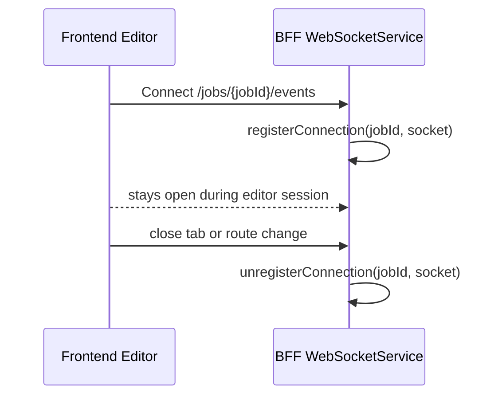
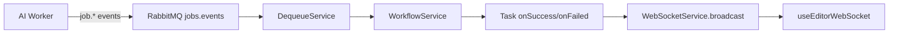

# WebSocket Flow in Careeros

How real-time task updates move from BFF to the editor UI.

## Current backend components
- Route + connection manager: `WebSocketService` (`apps/bff/src/websocket/websocket.service.ts`)
- Endpoint: `GET /jobs/:jobId/events`
- Event source: `WorkflowService` and task bundles call `websocket.broadcast(jobId, event)`

## Current frontend component
- Hook: `useEditorWebSocket` (`apps/web/src/hooks/useEditorWebSocket.ts`)

## Connection lifecycle

## Event delivery path

## Frontend behavior
- `useEditorWebSocket` opens `ws(s)://<bff>/jobs/{jobId}/events`.
- Completed/failed task messages are parsed by type guards in `src/type/websocket.event.type.ts`.
- The hook updates React Query cache key `['jobApplication', jobId]`.
- `Editor.tsx` and `Checklist.tsx` re-render from cache updates.
- Resume sync hook pushes `tailoredResume` into Zustand and triggers Typst recompile.

## Supported event types
- Completed:
  - `resume.parsing.completed`
  - `resume.tailoring.completed`
  - `checklist.parsing.completed`
  - `checklist.matching.completed`
  - `score.updating.completed`
- Failed:
  - `resume.parsing.failed`
  - `resume.tailoring.failed`
  - `checklist.parsing.failed`
  - `checklist.matching.failed`
  - `score.updating.failed`

## Notes
- BFF closes idle sockets after `WEBSOCKET_IDLE_TIMEOUT_MS` (default 5 minutes).
- Frontend hook implements reconnect with exponential backoff and max attempts.
