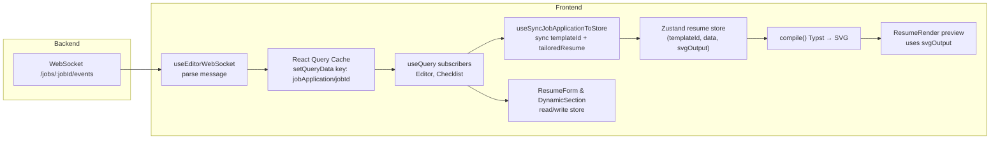

# WebSocket → UI Flow (Careeros Editor)

## Overview
- WebSocket receives job events (score, checklist parsing/matching, resume parsing/tailoring) at `/jobs/{jobId}/events`.
- `useEditorWebSocket` parses each message and writes it into React Query’s cache via `queryClient.setQueryData(['jobApplication', jobId], updater)`.
- `useQuery` subscribers for that key (`Editor.tsx`, `Checklist.tsx`) re-render with the new cached data—no refetch is triggered.
- `useSyncJobApplicationToStore` runs when the `useQuery` data changes and syncs `templateId` + `tailoredResume` into the Zustand resume store.
- The resume store recompiles Typst → SVG (`svgOutput`), and `ResumeRender` shows the updated preview; the form already reads the same store data.

## Data Flow (text diagram)
```
Backend WS → useEditorWebSocket → queryClient.setQueryData
   → React Query cache (['jobApplication', jobId])
      → useQuery subscribers (Editor, Checklist) update
         → useSyncJobApplicationToStore → Zustand resume store
            → compile() Typst → SVG → ResumeRender preview
```

## Data Flow (Mermaid)


## Components
- **WebSocket hook**: `useEditorWebSocket` (apps/web/src/hooks/useEditorWebSocket.ts) — connects, parses messages, calls `setQueryData`.
- **React Query cache**: `QueryClient` holds in-memory data/status for queries; `setQueryData` writes, `useQuery` reads/reacts.
- **useQuery subscribers**: `Editor.tsx`, `Checklist.tsx` use `useQuery({ queryKey: ['jobApplication', jobId], ... })`; they re-render on cache updates.
- **Sync hook**: `useSyncJobApplicationToStore` copies `templateId`/`tailoredResume` from the query result into the resume Zustand store.
- **Zustand store**: `useResumeStore` (apps/web/src/typst-compiler/resumeState.ts) holds resume data, templateId, svgOutput, and actions; `compile()` builds Typst and renders SVG.
- **UI**:
  - `ResumeForm`/`DynamicSection` read/write resume data via store actions.
  - `Checklist` reads `jobApplication` (from cache) and local resume data.
  - `ResumeRender` displays `svgOutput`.

## Concepts
- **React Query cache**: Client-side, in-memory; not the database. Updates via `setQueryData` push immediately to subscribers.
- **useQuery**: Subscribes to a query key; gets new data when the cache changes. No refetch unless invalidated/refetched explicitly.
- **setQueryData**: Writes/merges data into the cache; takes a key and updater function; does not hit the network.
- **Zustand store**: Shared client state outside React; multiple components subscribe via selectors. Holds resume data and compiles Typst → SVG for preview.
